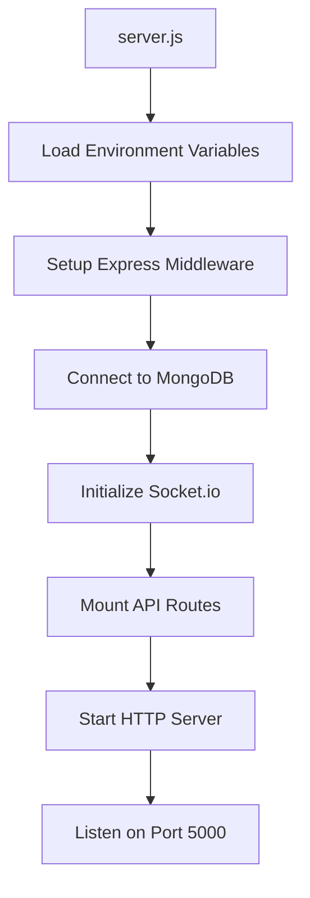

# Backend Architecture & File Flow

## 🗂️ Backend File Structure

```
backend/
├── 📄 server.js                    # Main entry point - Express server setup
├── 📄 package.json                 # Dependencies and scripts
├── 📄 .env                         # Environment variables
│
├── 📂 models/                      # Database Models (Mongoose Schemas)
│   ├── 📄 User.js                  # User model with authentication
│   ├── 📄 Topic.js                 # Learning topics model
│   ├── 📄 Session.js               # Video session model
│   └── 📄 WaitingPool.js           # Matching queue model
│
├── 📂 routes/                      # API Route Handlers
│   ├── 📄 auth.js                  # Authentication endpoints
│   ├── 📄 topics.js                # Topic CRUD operations
│   ├── 📄 sessions.js              # Session management
│   └── 📄 matching.js              # Matching system APIs
│
├── 📂 middleware/                  # Express Middleware
│   └── 📄 auth.js                  # JWT authentication middleware
│
├── 📂 socket/                      # WebSocket Handlers
│   └── 📄 socketHandler.js         # Real-time event handling
│
└── 📂 scripts/                     # Utility Scripts
    └── 📄 seedDatabase.js          # Database seeding script
```

## 🔄 Backend Data Flow

### 1. Server Initialization (server.js)



### 2. Request Flow Through Backend

```
Client Request → Express Server → Authentication Middleware → Route Handler → Database Operation → Response
```

## 📄 Key Backend Files Explained

### **server.js** - Application Entry Point
- **Purpose**: Main server configuration and startup
- **Key Features**:
  - Express app setup with security middleware (helmet, cors, rate limiting)
  - MongoDB connection using Mongoose
  - Socket.io integration for real-time features
  - Route mounting and error handling
  - Server startup on port 5000

**Code Flow**:
```javascript
require('dotenv').config() → 
Setup Express middleware → 
Connect MongoDB → 
Initialize Socket.io → 
Mount routes → 
Start server
```

### **Models Directory** - Database Schemas

#### **User.js**
- **Purpose**: User account management
- **Schema Fields**:
  - `username`: Unique identifier (3-30 chars)
  - `email`: Login credential (unique, validated)
  - `password`: Hashed with bcryptjs (min 6 chars)
  - `role`: 'learner' or 'mentor'
  - `isActive`: Account status
  - `lastSeen`: Last activity timestamp
  - `sessionsCompleted`: Progress tracking

**Key Methods**:
- `pre('save')`: Password hashing before database save
- `comparePassword()`: Password verification for login
- `toJSON()`: Remove password from API responses

#### **Topic.js**
- **Purpose**: Learning topic management
- **Schema Fields**:
  - `name`: Topic title (unique, max 100 chars)
  - `description`: Topic details (max 500 chars)
  - `category`: Predefined categories (Programming, Data Science, etc.)
  - `difficulty`: Beginner/Intermediate/Advanced
  - `tags`: Array of searchable keywords
  - `sessionsCount`: Usage statistics
  - `averageRating`: Quality metric

**Indexes**: Text search on name, description, and tags for fast searching

#### **Session.js**
- **Purpose**: Video chat session tracking
- **Schema Fields**:
  - `topic`: Reference to Topic model
  - `user1`, `user2`: Participant references
  - `roomId`: Unique session identifier (UUID)
  - `status`: waiting/active/completed/cancelled
  - `startTime`, `endTime`: Session duration
  - `feedback`: Ratings and comments from both users
  - `connectionDetails`: Agora channel information

**Hooks**: Automatic duration calculation on save

#### **WaitingPool.js**
- **Purpose**: Temporary storage for users awaiting matches
- **Schema Fields**:
  - `user`: Reference to User model
  - `topic`: Reference to Topic model
  - `joinedAt`: Queue entry time
  - `socketId`: Real-time connection identifier
  - `isActive`: Pool status

**Indexes**: Compound index on user+topic for uniqueness, topic+isActive for fast matching

### **Routes Directory** - API Endpoints

#### **auth.js** - Authentication System
**Endpoints**:
- `POST /api/auth/register`: Create new user account
- `POST /api/auth/login`: User authentication
- `GET /api/auth/verify`: Token validation
- `GET /api/auth/profile`: Get user profile
- `PUT /api/auth/profile`: Update user information

**Flow**:
```
Registration → Input validation → Check duplicates → Hash password → Save user → Generate JWT → Return token + user
Login → Input validation → Find user → Verify password → Update lastSeen → Generate JWT → Return token + user
```

#### **topics.js** - Topic Management
**Endpoints**:
- `GET /api/topics`: List topics with filtering/pagination
- `GET /api/topics/:id`: Get single topic with statistics
- `POST /api/topics`: Create new topic (mentor only)
- `PUT /api/topics/:id`: Update topic (mentor only)
- `GET /api/topics/meta/categories`: Get available categories
- `GET /api/topics/meta/popular`: Get trending topics

**Features**:
- Search functionality using MongoDB text indexes
- Category and difficulty filtering
- Pagination for large datasets
- Role-based access control for creation/editing

#### **sessions.js** - Session Management
**Endpoints**:
- `GET /api/sessions/history`: User's session history
- `GET /api/sessions/:id`: Get session details
- `PATCH /api/sessions/:id/end`: End active session
- `POST /api/sessions/:id/feedback`: Submit session feedback
- `GET /api/sessions/stats/overview`: User statistics

**Security**: All endpoints require authentication, participants can only access their own sessions

#### **matching.js** - Real-time Matching
**Endpoints**:
- `POST /api/matching/join`: Join waiting pool for topic
- `POST /api/matching/leave`: Leave waiting pool
- `GET /api/matching/status`: Current waiting status
- `GET /api/matching/stats/:topicId`: Topic waiting statistics
- `POST /api/matching/cancel`: Cancel session or waiting

**Matching Algorithm**:
```
User joins topic → Check for existing waiter → If found: create session → If not: add to pool
```

### **middleware/auth.js** - Security Layer
**Purpose**: JWT token validation for protected routes
**Process**:
1. Extract Bearer token from Authorization header
2. Verify token using JWT secret
3. Find user in database
4. Attach user object to request
5. Continue to route handler or return 401

### **socket/socketHandler.js** - Real-time Features
**Purpose**: WebSocket event handling for live features
**Key Events**:
- `connection`: User connects with JWT authentication
- `joinWaitingPool`: Real-time pool management
- `joinSession`: Video chat room joining
- `offer/answer/ice-candidate`: WebRTC signaling
- `sessionMessage`: Real-time chat
- `disconnect`: Cleanup and status updates

**Features**:
- JWT-based socket authentication
- Active connection tracking
- Automatic cleanup of disconnected users
- Room-based messaging for sessions

### **scripts/seedDatabase.js** - Database Utilities
**Purpose**: Initialize database with sample data
**Content**: 10 predefined topics across various categories
**Usage**: `node scripts/seedDatabase.js`

## 🔗 File Connections & Dependencies

### **Dependency Graph**:
```
server.js
├── models/ (User, Topic, Session, WaitingPool)
├── routes/ (auth, topics, sessions, matching)
├── middleware/auth.js
└── socket/socketHandler.js
    ├── models/
    └── middleware/auth.js
```

### **Data Flow Between Files**:
1. **server.js** loads all routes and middleware
2. **Routes** use models for database operations
3. **middleware/auth.js** validates requests before reaching routes
4. **socketHandler.js** uses models and auth for real-time features
5. **Models** define database structure and validation rules

This architecture ensures clean separation of concerns, maintainability, and scalability.