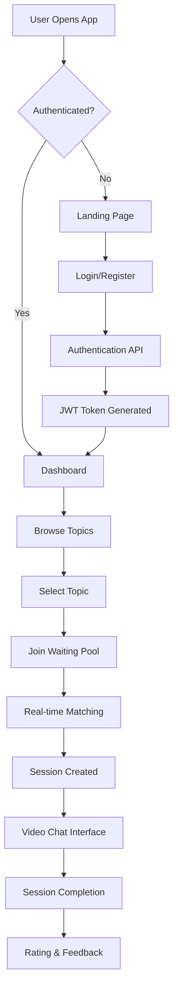
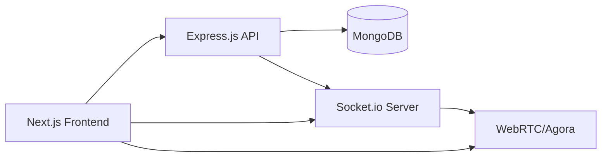

# Complete Project Flow & File Connections

## 🌟 System Overview

The Topic Video Learning Platform is a real-time educational platform that connects learners with mentors for video-based learning sessions. This document explains how all components work together to create seamless user experiences.

## 🔄 Complete Application Flow

### **1. User Journey Flow**



### **2. Technical Data Flow**



## 📂 File Connection Map

### **Frontend to Backend Connections**

#### **Authentication Flow**
```
frontend/src/app/login/page.tsx
    ↓ (API call via axios)
frontend/src/lib/api.ts
    ↓ (HTTP POST request)
backend/routes/auth.js → /api/auth/login
    ↓ (middleware chain)
backend/middleware/auth.js
    ↓ (database operation)
backend/models/User.js
    ↓ (password comparison)
bcrypt.compare()
    ↓ (token generation)
jsonwebtoken.sign()
    ↓ (response with JWT)
frontend/src/contexts/AuthContext.tsx
    ↓ (context state update)
All Protected Components
```

#### **Topic Browsing Flow**
```
frontend/src/app/topics/page.tsx
    ↓ (useEffect API call)
frontend/src/lib/api.ts → GET /api/topics
    ↓ (route handler)
backend/routes/topics.js
    ↓ (MongoDB query)
backend/models/Topic.js
    ↓ (aggregation pipeline)
MongoDB Collection: topics
    ↓ (JSON response)
frontend/src/app/topics/page.tsx
    ↓ (state update & render)
Topic Cards with Real-time Stats
```

#### **Session Matching Flow**
```
frontend/src/app/session/start/page.tsx
    ↓ (topic selection)
Socket Event: 'join-waiting-pool'
    ↓ (Socket.io connection)
frontend/src/lib/socket.ts
    ↓ (real-time communication)
backend/socket/socketHandlers.js
    ↓ (waiting pool logic)
backend/services/matchingService.js
    ↓ (database operations)
backend/models/WaitingPool.js & Session.js
    ↓ (match found event)
Socket Event: 'match-found'
    ↓ (session creation)
Agora.io Video Room
    ↓ (UI update)
frontend/src/app/session/waiting/[topicId]/page.tsx
```

## 🗃️ Detailed File Relationships

### **Backend File Dependencies**

#### **server.js** - Application Bootstrap
```javascript
// Dependencies and their purposes
const express = require('express');           // Web framework
const mongoose = require('mongoose');         // MongoDB ODM
const cors = require('cors');                // Cross-origin requests
const helmet = require('helmet');            // Security headers
const http = require('http');                // HTTP server
const socketIo = require('socket.io');       // Real-time communication

// Local imports and their connections
const connectDB = require('./config/database');     // → config/database.js
const authRoutes = require('./routes/auth');        // → routes/auth.js
const topicRoutes = require('./routes/topics');     // → routes/topics.js
const sessionRoutes = require('./routes/sessions'); // → routes/sessions.js
const matchingRoutes = require('./routes/matching'); // → routes/matching.js
const socketHandlers = require('./socket/socketHandlers'); // → socket/socketHandlers.js
```

#### **Routes Connection Chain**
```
routes/auth.js
├── middleware/auth.js (JWT verification)
├── middleware/validation.js (Input validation)
├── models/User.js (User operations)
└── controllers/authController.js (Business logic)

routes/topics.js
├── models/Topic.js (Topic queries)
├── models/WaitingPool.js (Real-time stats)
└── middleware/rateLimiting.js (API protection)

routes/sessions.js
├── middleware/auth.js (Protected routes)
├── models/Session.js (Session CRUD)
├── models/User.js (Profile updates)
└── services/agoraService.js (Video room management)

routes/matching.js
├── models/WaitingPool.js (Queue management)
├── services/matchingService.js (Matching algorithm)
└── socket/socketHandlers.js (Real-time notifications)
```

#### **Model Relationships**
```
models/User.js
├── Pre-save hooks → bcrypt (password hashing)
├── Instance methods → comparePassword()
├── Virtual properties → session statistics
└── Referenced in → Session.participants, WaitingPool.userId

models/Topic.js
├── Text indexes → MongoDB full-text search
├── Virtual properties → popularity calculations
├── Referenced in → Session.topicId, WaitingPool.topicId
└── Stats updates ← Session completion events

models/Session.js
├── References → User (participants), Topic (topicId)
├── Embedded documents → messages[], sessionData
├── Pre-save hooks → roomId generation
└── Post-save hooks → topic statistics updates

models/WaitingPool.js
├── TTL index → automatic cleanup (30 minutes)
├── Static methods → findMatch(), updatePositions()
├── References → User (userId), Topic (topicId), Session (sessionId)
└── Real-time updates ← Socket.io events
```

### **Frontend File Dependencies**

#### **App Router Structure**
```
src/app/layout.tsx (Root Layout)
├── AuthProvider (contexts/AuthContext.tsx)
├── Font loading (Google Fonts)
├── Global CSS (styles/globals.css)
└── Child Pages:
    ├── page.tsx (Landing Page - Public)
    ├── login/page.tsx (Authentication)
    ├── register/page.tsx (User Registration)
    ├── dashboard/page.tsx (Protected - User Stats)
    ├── topics/page.tsx (Topic Browsing)
    ├── session/start/page.tsx (Protected - Topic Selection)
    └── session/waiting/[topicId]/page.tsx (Protected - Waiting Room)
```

#### **Context and Service Layer**
```
contexts/AuthContext.tsx
├── State management → user, isAuthenticated, isLoading
├── API integration → lib/api.ts
├── Socket management → lib/socket.ts
└── Provides context to → All components

lib/api.ts (HTTP Client)
├── Axios configuration → baseURL, timeout, interceptors
├── Automatic JWT attachment → Authorization headers
├── Error handling → 401 redirects, token refresh
└── Used by → All pages, AuthContext

lib/socket.ts (WebSocket Client)
├── Socket.io client → Real-time communication
├── JWT authentication → Connection authorization
├── Event management → emit/listen patterns
└── Used by → AuthContext, Session pages
```

#### **Component Communication Patterns**
```
Page Component
    ↓ (user interaction)
Context Method (AuthContext)
    ↓ (business logic)
Service Layer (api.ts/socket.ts)
    ↓ (network request)
Backend API/Socket
    ↓ (data processing)
Database Operation
    ↓ (response)
Service Layer
    ↓ (context update)
Component Re-render
```

## 🔄 Real-time Communication Flow

### **Socket.io Event Chain**

#### **Waiting Pool Events**
```
Frontend Action: Join Topic
    ↓
socket.emit('join-waiting-pool', { topicId, role })
    ↓
backend/socket/socketHandlers.js → handleJoinWaitingPool()
    ↓
services/matchingService.js → addToWaitingPool()
    ↓
models/WaitingPool.js → create new entry
    ↓
Matching Algorithm Check
    ↓ (if match found)
models/Session.js → create new session
    ↓
socket.emit('match-found', { sessionId, roomId })
    ↓
Frontend: Redirect to video session
```

#### **Session Events**
```
Video Session Start:
socket.emit('join-session', { sessionId, roomId })
    ↓
Agora.io Room Creation
    ↓
WebRTC Connection Establishment
    ↓
Real-time Video/Audio Streams

Chat Messages:
socket.emit('session-message', { sessionId, message })
    ↓
models/Session.js → messages.push()
    ↓
socket.broadcast('new-message', messageData)
    ↓
All session participants receive message
```

## 🏗️ Architecture Patterns

### **1. MVC Pattern (Backend)**
```
Models (Data Layer):
├── User.js → User data and authentication
├── Topic.js → Learning topic management
├── Session.js → Session state and history
└── WaitingPool.js → Real-time matching queue

Views (Response Layer):
├── JSON API responses
├── Error handling middleware
└── Response formatting utilities

Controllers (Business Logic):
├── Authentication flow
├── Topic management
├── Session orchestration
└── Matching algorithms
```

### **2. Component-Based Architecture (Frontend)**
```
Layout Components:
├── RootLayout → Global layout and providers
├── Navigation → Header with auth state
└── Footer → Branding and links

Page Components:
├── Landing → Marketing and CTA
├── Auth Pages → Login/Register forms
├── Dashboard → User statistics overview
├── Topic Pages → Browse and selection
└── Session Pages → Waiting and video interface

Context Providers:
├── AuthContext → Global authentication state
├── ThemeContext → UI theme management
└── NotificationContext → Toast notifications

Service Utilities:
├── API Client → HTTP communication
├── Socket Service → Real-time events
└── Validation → Form validation utilities
```

### **3. Event-Driven Architecture**
```
Database Events:
├── User registration → Welcome email trigger
├── Session completion → Statistics update
├── Topic creation → Search index update
└── Rating submission → Average calculation

Socket Events:
├── User connection → Online status update
├── Waiting pool changes → Real-time UI updates
├── Session events → Participant notifications
└── Match found → Session invitation

API Events:
├── Authentication → JWT token generation
├── Profile updates → Statistics recalculation
├── Session actions → Database state changes
└── Error handling → Logging and monitoring
```

## 📊 Data Synchronization

### **Frontend-Backend Sync**
```
1. Initial Page Load:
   ├── AuthContext checks localStorage JWT
   ├── If valid → API call to /api/auth/me
   ├── User data populated in context
   └── Protected routes accessible

2. Real-time Updates:
   ├── Socket connection established
   ├── Subscribe to user-specific events
   ├── Background data refresh
   └── UI updates without page reload

3. Optimistic Updates:
   ├── UI updates immediately
   ├── API call in background
   ├── Rollback on error
   └── Success confirmation
```

### **Database Consistency**
```
1. User Registration:
   ├── Validate unique email/username
   ├── Hash password with bcrypt
   ├── Create user record
   ├── Generate JWT token
   └── Initialize profile statistics

2. Session Creation:
   ├── Remove users from waiting pool
   ├── Create session record
   ├── Generate Agora room ID
   ├── Update topic statistics
   └── Notify participants via socket

3. Session Completion:
   ├── Update session status
   ├── Calculate duration
   ├── Update user statistics
   ├── Update topic statistics
   └── Clean up resources
```

## 🔧 Error Handling & Recovery

### **Frontend Error Boundaries**
```
Global Error Handling:
├── API interceptors → Automatic retry logic
├── Socket reconnection → Exponential backoff
├── Form validation → Real-time feedback
└── Network errors → Offline mode indicators

Component Error Boundaries:
├── Page-level error catching
├── Fallback UI components
├── Error reporting to backend
└── Graceful degradation
```

### **Backend Error Management**
```
Middleware Stack:
├── Request validation → Input sanitization
├── Authentication → JWT verification
├── Authorization → Role-based access
├── Rate limiting → DDoS protection
├── Error handling → Consistent responses
└── Logging → Winston/Morgan integration

Database Operations:
├── Connection pooling → Automatic reconnection
├── Transaction support → Data consistency
├── Validation errors → User-friendly messages
└── Performance monitoring → Query optimization
```

This comprehensive flow documentation shows how every file in the Topic Video Learning Platform connects and communicates to deliver a seamless real-time educational experience.